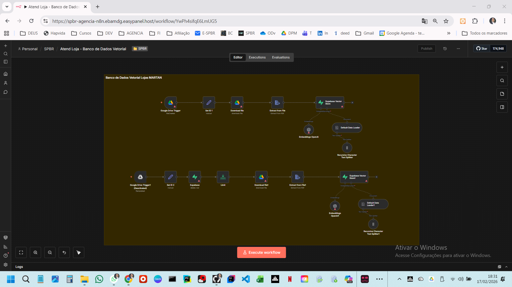
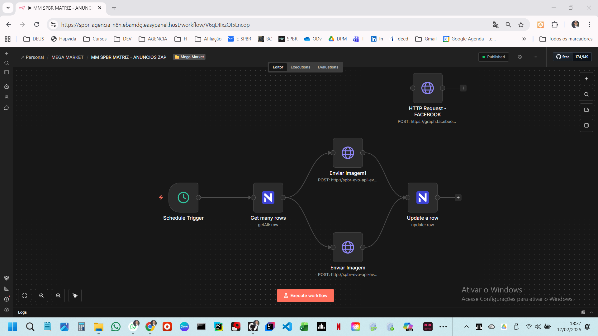

# N8N-automation-solutions-Portfolio
Profissional repository flows - N8N
# n8n Automation & Systems Architecture Portfolio 🤖

Advanced automation workflows focused on scalability, AI multi-agent orchestration, and seamless API integrations.

---

## 🚀 Featured High-Complexity Workflows

### 1️⃣ AI Multi-Agent CRM Orchestration
**The Challenge:** Managing complex customer service flows that require different "expert" AI personas and real-time CRM updates.
**The Solution:** A multi-agent system using OpenAI that identifies intent, queries the CRM, and routes the ticket to the specific department agent.
* **Stack:** `n8n`, `OpenAI`, `CRM Integration`, `Multi-agent Logic`.

---

### 2️⃣ Vector Database & E-commerce Intelligence
**The Challenge:** Syncing real-time inventory from Bling/WooCommerce while providing a semantic search layer for customer support.
**The Solution:** An ETL pipeline that fetches data from Bling/WooCommerce, processes it, and stores embeddings in Supabase (Vector Store) for high-speed AI retrieval.
* **Stack:** `Supabase`, `Bling API`, `WooCommerce`, `Vector Embeddings`.

---

### 3️⃣ Omnichannel Content & Lead Generation
**The Challenge:** Orchestrating marketing content distribution across Facebook, WhatsApp, and Telegram without losing lead tracking.
**The Solution:** A centralized engine that generates localized content and manages triggers across 3+ messaging platforms simultaneously.
* **Stack:** `WhatsApp API`, `Facebook Advertise`, `Telegram Bot`, `Lead Scoring`.

---

## 🛠️ Technical Expertise
* **Architecture:** Self-hosted n8n on VPS, Docker orchestration.
* **Data:** PostgreSQL, Supabase, Vector Databases, JSON Transformation.
* **Security:** GDPR/LGPD compliant workflows, secure credential management (Environment Variables).

## 📬 Contact & Demos
For a deep dive into the logic or a live walkthrough of the full JSON architectures, feel free to reach out.

**LinkedIn:** [Your Link Here]
